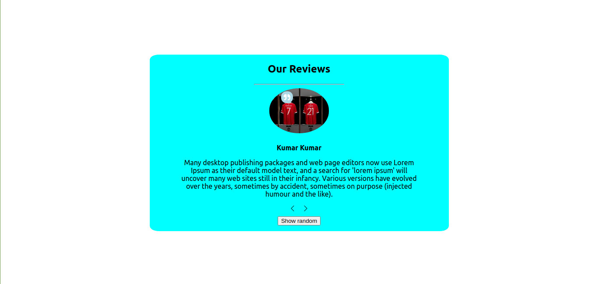

# Static Reviews Site in React js

This project is made with React and Raw Css It display the example reviews given by the People, For simplicity It is only getting data from the file not from the API.

## How to run the project

Clone the repo, In project directory, run:

### `npm install`

Runs the app using npm run start. App will be started on port 3000
### `Example of how project will lock like`

### `Example of Live Link of the project is`
https://nostalgic-thompson-5a480b.netlify.app/